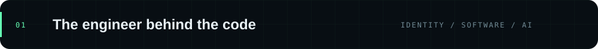
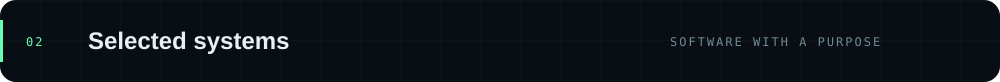
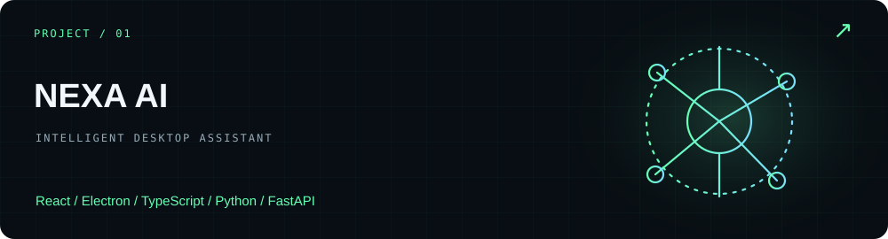
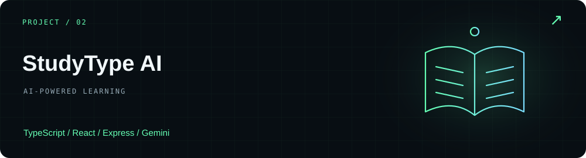
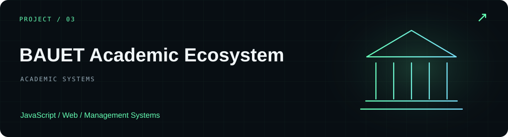
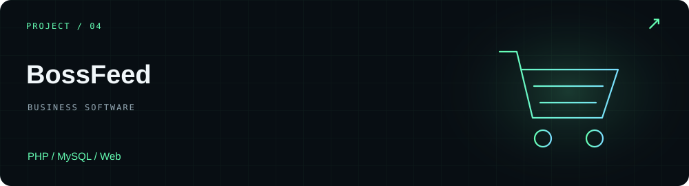
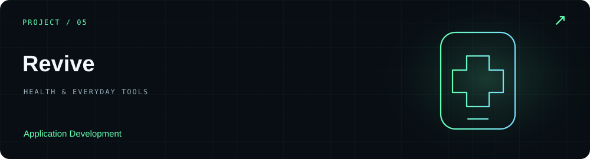
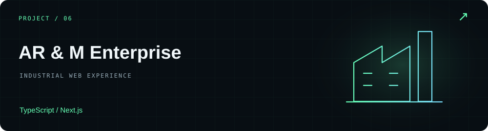
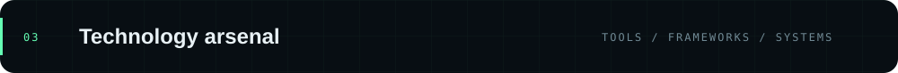
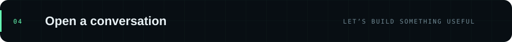

<!-- Generated from profile.json. Run npm run build after editing. -->

  

<a href="https://abdurrahman-khaki.vercel.app/">Explore my portfolio ↗</a> &nbsp; · &nbsp; <a href="#selected-work">Selected work</a> &nbsp; · &nbsp; <a href="#connect">Get in touch</a>

I design and build software, web applications, automation systems, and developer tools. My work brings together APIs, Android applications, management platforms, and AI-powered experiences—with an interest in computer vision, machine learning, and deep learning.

**Education** · Computer Science &amp; Engineering — Bangladesh Army University of Engineering &amp; Technology (BAUET)

| Right now | |
| :--- | :--- |
| **Building** | AI assistants, full-stack applications, and intelligent automation. |
| **Exploring** | Computer vision, machine learning, deep learning, and advanced software tools. |

<samp>PLAN → DESIGN → BUILD → AUTOMATE → TEST → IMPROVE</samp>

A Windows AI assistant combining voice, chat, live web answers, reminders, and permission-controlled desktop actions. Built around a React and Electron client with a local FastAPI service.

<a href="https://github.com/abdurrahman422/nexa_ai">Explore repository ↗</a>

 

Written-recall examinations with Gemini-powered semantic evaluation, structured academic rubrics, typing telemetry, and learning analytics.

<a href="https://github.com/abdurrahman422/StudyType-AI">Explore repository ↗</a> &nbsp; · &nbsp; <a href="https://study-type-ai.vercel.app/">Live demo ↗</a>

 

An academic platform connecting management workflows, student services, and digital campus systems.

<a href="https://github.com/abdurrahman422/bauet-academic-ecosystem">Explore repository ↗</a> &nbsp; · &nbsp; <a href="https://bauet-academic-ecosystem.vercel.app/">Live demo ↗</a>

 

A poultry and home animal feed management system covering products, users, orders, payments, and administration.

<a href="https://github.com/abdurrahman422/BossFeed">Explore repository ↗</a>

 

A medicine reminder application focused on an everyday healthcare need.

<a href="https://github.com/abdurrahman422/Revive">Explore repository ↗</a>

 

A web project for feed mill engineering and industrial solutions.

<a href="https://github.com/abdurrahman422/AR-M--Enterprise">Explore repository ↗</a>

 

<a href="https://github.com/abdurrahman422?tab=repositories">Browse all repositories ↗</a>

<code>Python</code> &nbsp; <code>TypeScript</code> &nbsp; <code>JavaScript</code> &nbsp; <code>C/C++</code> &nbsp; <code>PHP</code> &nbsp; <code>React</code> &nbsp; <code>Node.js</code> &nbsp; <code>FastAPI</code> &nbsp; <code>Android</code> &nbsp; <code>PyTorch</code> &nbsp; <code>TensorFlow</code> &nbsp; <code>OpenCV</code> &nbsp; <code>MySQL</code> &nbsp; <code>PostgreSQL</code> &nbsp; <code>Docker</code> &nbsp; <code>Linux</code> &nbsp; <code>Git</code>

<a href="https://github.com/abdurrahman422">GitHub ↗</a> &nbsp; · &nbsp; <a href="https://abdurrahman-khaki.vercel.app/">Portfolio ↗</a> &nbsp; · &nbsp; <a href="https://www.linkedin.com/in/abdurrahman422/">LinkedIn ↗</a> &nbsp; · &nbsp; <a href="mailto:abdurrahman422488@gmail.com">Email ↗</a>

---

Made with curiosity. Always a work in progress.

