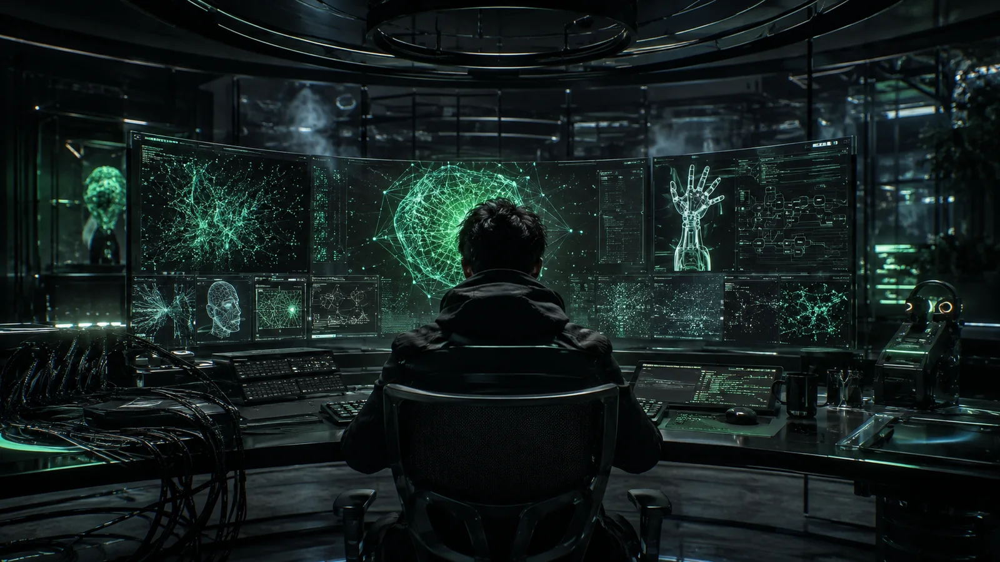
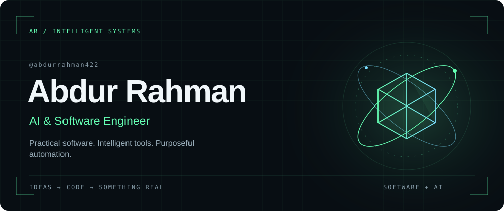
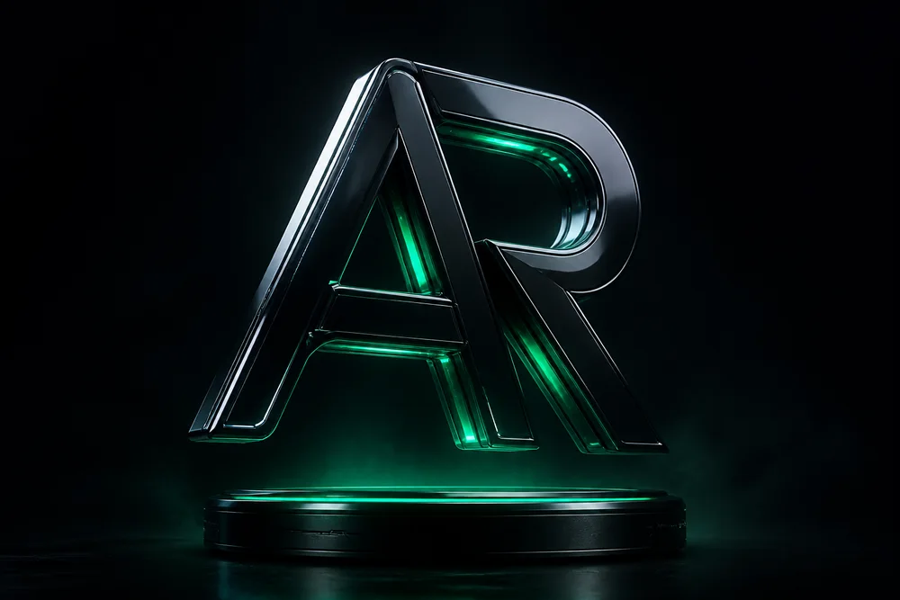
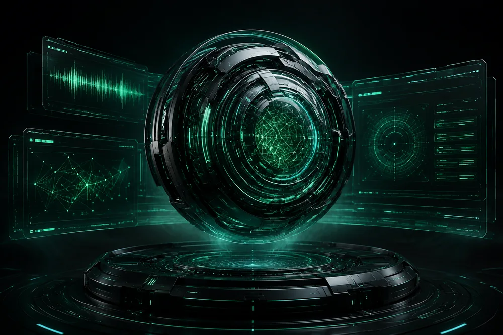
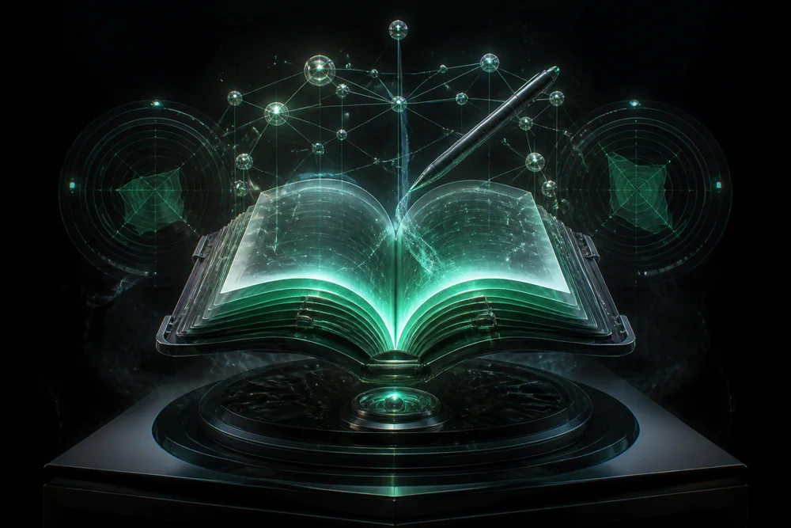
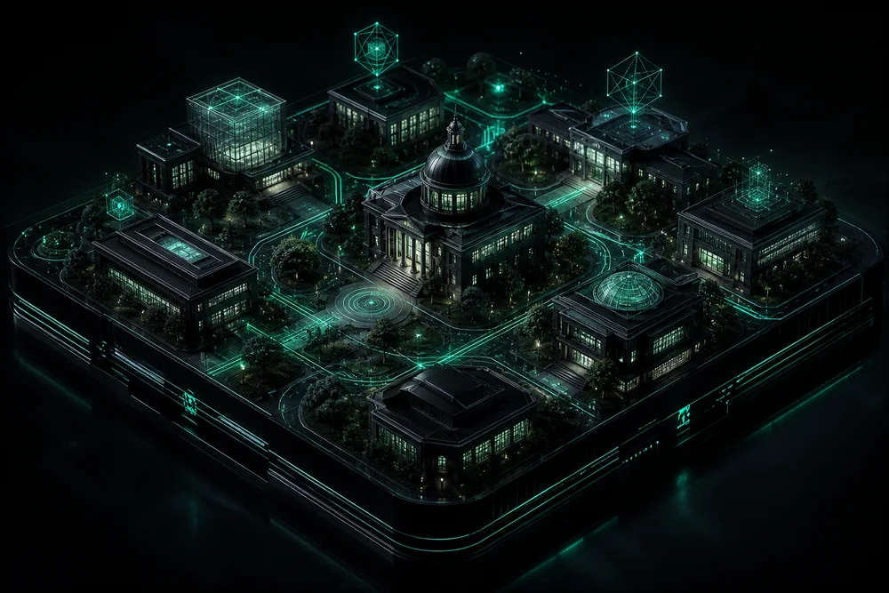
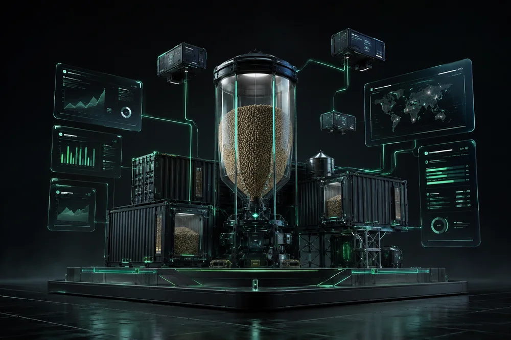
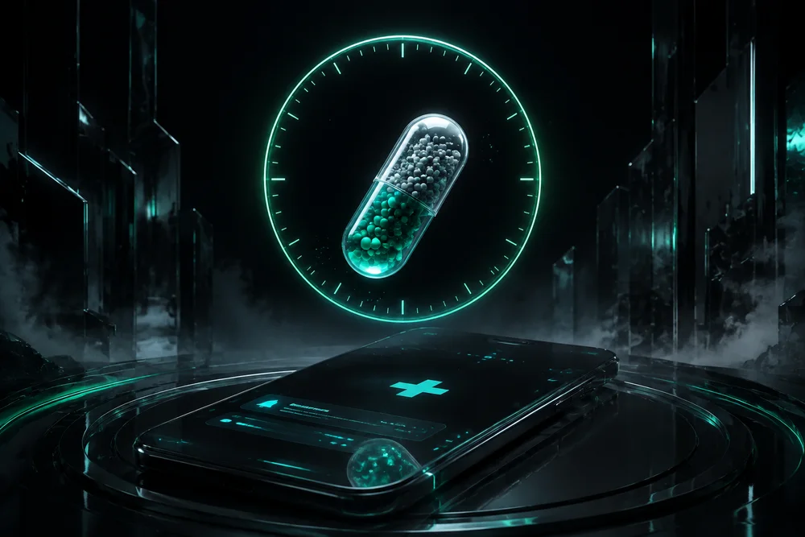
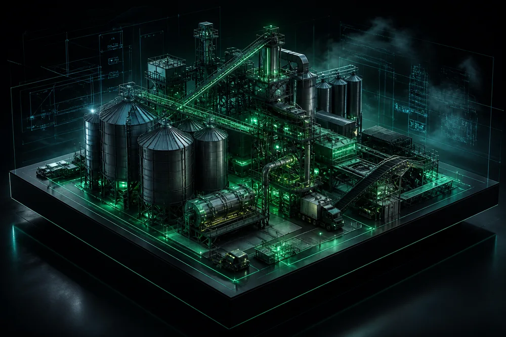

<div align="center">

<br/><br/>
<br/><br/>

```console
SYSTEM INITIALIZED // IDENTITY VERIFIED // AI + SOFTWARE CHANNEL ONLINE █
```
</div>

---

<div id="identity" align="center">

### `02 // IDENTITY`
## OPERATOR DOSSIER
</div>

<table><tr><td width="38%" align="center"><br/><code>OPERATOR // AR-422</code></td><td width="62%"><h2>ABDUR RAHMAN // INTELLIGENT SYSTEMS</h2><p><b>ROLE:</b> AI &amp; Software Engineer</p><p><b>SPECIALIZATION:</b> Software • AI Automation • Full-Stack Systems • Intelligent Tools</p><p><b>FOUNDATION:</b> Computer Science &amp; Engineering — BAUET</p><p><b>EXECUTION:</b> <code>PLAN • DESIGN • BUILD • AUTOMATE • TEST • IMPROVE</code></p><p><b>DIRECTIVE:</b> Build practical software that turns complex workflows into useful systems.</p><p><b>STATUS:</b> 🟢 ACTIVE</p></td></tr></table>

I design practical digital products across web platforms, APIs, Android applications, management systems, developer tools, and AI automation. Machine learning, deep learning, neural networks, and computer vision form the intelligent layer of my work.

---

<div align="center">

### `03 // SIGNAL`
## WHAT I ENGINEER
</div>

| SOFTWARE SYSTEMS | INTELLIGENT AUTOMATION | FULL-STACK WEB | APPLIED AI |
| :---: | :---: | :---: | :---: |
| Applications, APIs & tools | Assistants & workflows | Interfaces, services & data | Vision, ML & deep learning |
| `BUILD • SHIP` | `THINK • ACT` | `END • TO • END` | `LEARN • ADAPT` |

---

<div align="center">

### `04 // ARSENAL`
## TECHNOLOGY SYSTEMS
</div>

| SYSTEM LAYER | ACTIVE ARSENAL & PROTOCOLS |
| :--- | :--- |
| **LANGUAGE CORE** | `Python` • `TypeScript` • `JavaScript` • `C/C++` • `PHP` |
| **INTERFACE** | `React` • `Next.js` • `HTML/CSS` • `Android` |
| **BACKEND** | `Node.js` • `Express` • `FastAPI` • `REST APIs` |
| **INTELLIGENCE** | `Gemini` • `PyTorch` • `TensorFlow` • `OpenCV` |
| **DATA** | `MySQL` • `PostgreSQL` • `SQLite` • `JSON` |
| **DELIVERY** | `Docker` • `Linux` • `Git` • `GitHub` • `Vite` |

---

<div align="center">

### `05 // PROJECT ARCHIVE`
## SELECTED SYSTEMS RECOVERED FROM THE STACK
*Every project is a case file built around a real problem.*
</div>

<table><tr><td width="55%"><a href="https://github.com/abdurrahman422/nexa_ai"></a></td><td width="45%"><code>CASE FILE // 01</code> · <b>ACTIVE</b><h3>NEXA AI</h3><p><b>INTELLIGENT DESKTOP ASSISTANT</b></p><p><code>React</code> <code>Electron</code> <code>TypeScript</code> <code>Python</code> <code>FastAPI</code></p><p>A local-first Windows assistant combining chat, voice, live web answers, reminders, content tools, and permission-controlled desktop actions.</p><a href="https://github.com/abdurrahman422/nexa_ai"><b>[INSPECT REPOSITORY]</b></a></td></tr></table>

<br/>

<table><tr><td width="55%"><a href="https://study-type-ai.vercel.app"></a></td><td width="45%"><code>CASE FILE // 02</code> · <b>LIVE</b><h3>STUDYTYPE AI</h3><p><b>AI WRITTEN-RECALL ENGINE</b></p><p><code>TypeScript</code> <code>React</code> <code>Express</code> <code>Gemini</code></p><p>Generates descriptive exams, grades meaning with academic rubrics, tracks typing telemetry, and visualizes mastery and retention.</p><a href="https://github.com/abdurrahman422/StudyType-AI"><b>[REPOSITORY]</b></a> · <a href="https://study-type-ai.vercel.app"><b>[LIVE DEMO]</b></a></td></tr></table>

<br/>

<table><tr><td width="55%"></td><td width="45%"><code>CASE FILE // 03</code> · <b>LIVE</b><h3>BAUET ACADEMIC ECOSYSTEM</h3><p><b>CONNECTED CAMPUS PLATFORM</b></p><p><code>JavaScript</code> <code>Web Systems</code> <code>Management</code></p><p>A connected ecosystem for academic workflows, management, student services, and digital campus operations.</p><a href="https://github.com/abdurrahman422/bauet-academic-ecosystem"><b>[REPOSITORY]</b></a> · <a href="https://bauet-academic-ecosystem.vercel.app"><b>[LIVE DEMO]</b></a></td></tr></table>

<br/>

<table><tr><td width="55%"></td><td width="45%"><code>CASE FILE // 04</code><h3>BOSSFEED</h3><p><b>BUSINESS OPERATIONS SYSTEM</b></p><p><code>PHP</code> <code>MySQL</code> <code>Web</code></p><p>Feed-business management spanning inventory, products, users, orders, payments, and administration.</p><a href="https://github.com/abdurrahman422/BossFeed"><b>[INSPECT REPOSITORY]</b></a></td></tr></table>

<br/>

<table><tr><td width="55%"></td><td width="45%"><code>CASE FILE // 05</code><h3>REVIVE</h3><p><b>MEDICINE REMINDER APPLICATION</b></p><p>A focused application helping people organize medicine reminders through a clear everyday workflow.</p><a href="https://github.com/abdurrahman422/Revive"><b>[INSPECT REPOSITORY]</b></a></td></tr></table>

<br/>

<table><tr><td width="55%"></td><td width="45%"><code>CASE FILE // 06</code><h3>AR &amp; M ENTERPRISE</h3><p><b>INDUSTRIAL ENGINEERING WEB</b></p><p><code>Next.js</code> <code>TypeScript</code></p><p>A modern digital presence for feed mill engineering and industrial solutions.</p><a href="https://github.com/abdurrahman422/AR-M--Enterprise"><b>[INSPECT REPOSITORY]</b></a></td></tr></table>

---

<div align="center">

### `06 // EXPERIMENT LAB`
## WHERE INTELLIGENCE BECOMES SOFTWARE

| APPLIED AI | COMPUTER VISION | AUTOMATION |
| :---: | :---: | :---: |
| Assistants, semantic evaluation & utilities | Image understanding & visual experiments | Permission-aware workflows & tools |
| `LLMs • AGENTS • RAG` | `OPENCV • PYTORCH` | `PYTHON • APIs • TOOLS` |

---

### `07 // DIGITAL FOOTPRINT`
## ACTIVITY & TELEMETRY MATRIX


</div>

---

### `08 // SYSTEM TERMINAL`

```bash
abdur@systems ~ $ whoami
AI & Software Engineer

abdur@systems ~ $ building
AI assistants • full-stack applications • intelligent automation

abdur@systems ~ $ exploring
computer vision • machine learning • deep learning • advanced tools

abdur@systems ~ $ status
ONLINE █
```

---

<div align="center">

### `09 // FOUNDATION`
## COMPUTER SCIENCE & ENGINEERING
**Bangladesh Army University of Engineering & Technology (BAUET)**

Algorithms • Software Engineering • Web Systems • Automation • Artificial Intelligence

## *“Useful intelligence begins with dependable software.”*
`PLAN • DESIGN • BUILD • AUTOMATE • TEST • IMPROVE`

---

### `10 // TRANSMISSION`
## OPEN A CHANNEL

<a href="https://github.com/abdurrahman422"></a> <a href="https://abdurrahman-khaki.vercel.app/"></a> <a href="https://www.linkedin.com/in/abdurrahman422/"></a> <a href="mailto:abdurrahman422488@gmail.com"></a>

`CHANNEL OPEN // READY TO COLLABORATE`
</div>
